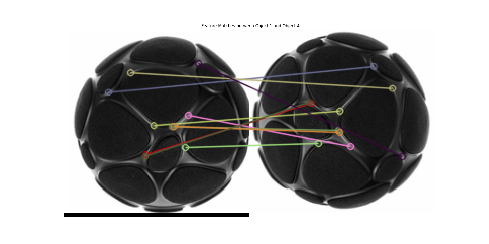

# 6DoF-Audio-Toolbox

## Zylia Microphone Array Rotation Detection by Image.

"detect_micarray_rotation_by_image.py" detects circular objects from the top view visuals of microphone arrays in an image, sorts them based on their positions, and calculates the rotational misalignment between the reference (upper-leftmost object) and all others. It uses the Hough Circle Transform for detection and ORB feature matching for rotation angle calculation.

### Features:
- Detects circular objects in a grayscale image using the Hough Circle Transform.
- Sorts detected circles from upper-left to bottom-right (0 being the reference)
- Crops detected circles individually with a margin (not to accidentally crop the image) for feature detection.
- Calculates rotational angles between the first detected circle and all others using ORB feature matching and affine transformation.
- Visualizes detected circles and feature matches for verification.

### Usage:
1. Place the top view image of the recording setup in the same directory as the script or update the `new_image_path` variable.
2. Run the script to detect and visualize the circles and their rotational misalignment.
3. The script will output the rotation angles and display the matching features between the reference circle and others.

### Dependencies:
- OpenCV
- NumPy
- Matplotlib

Example:

Input image of 5 Zylia Mics rotated arbitrarily:

Detected circles in the image:
Detected circles in the image:

Features found for the object 1 and 4:

Console output:
Rotation Angles: [  0.  -16.3   5.5 -90.   45.4]
